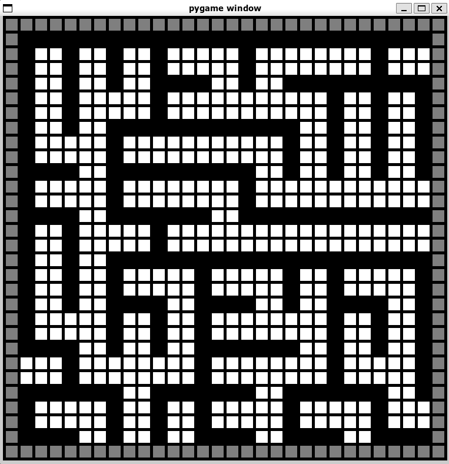
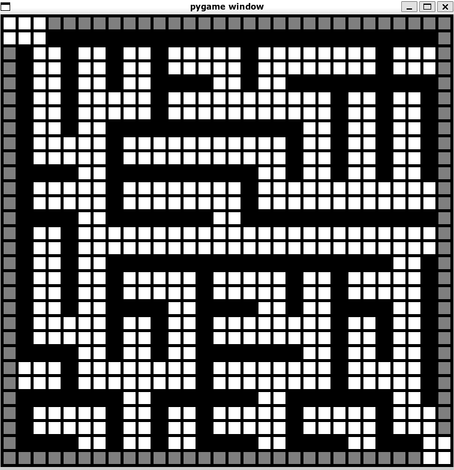
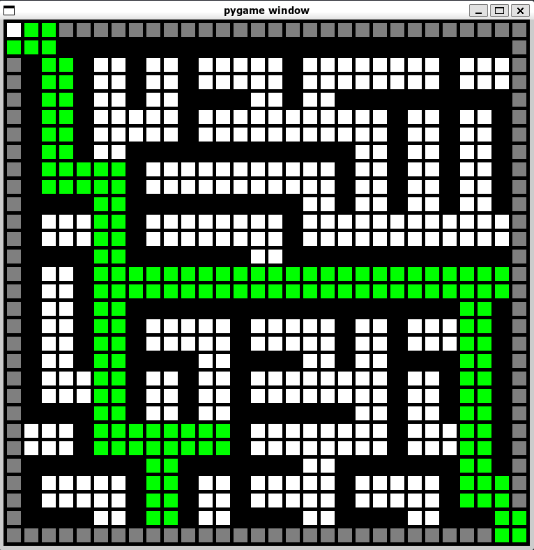
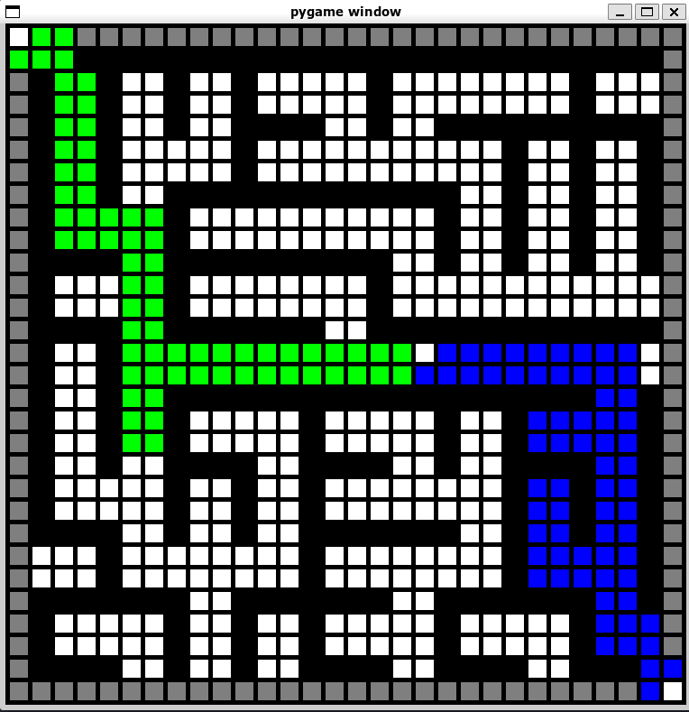
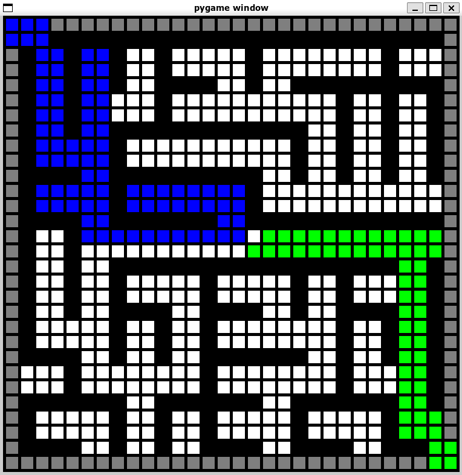

# 4633-AI-Project

## Dependencies & Running Project
To run this project ensure that you have installed the pygame and numpy packages.

Following installation of the required packages, simply navigate to the directory in your filesystem and run the program. 

## Edit Maze Phase
The first screen to pop-up will be where you can edit the maze that will be solved. The black squares are walls and the white squares are open to being in the path. By clicking on black squares they will become open and by clicking on white squares a wall will be added

When editing the maze make sure that you open the top left and bottom right ends of the maze!
Also, very important tip for running our novel approach! The last space that is clicked on will be the start of our novel approach, make sure to click on a white square before closing the window. 

## A-star Search Phase
After closing the first window, another will soon pop-up and A-star will be used to traverse your edited maze. 

## Bidirectional Search Phase
Following the closing of the A-star search window, A bidirectional search will then be used to solve the maze in another window. 

## Novel Search Phase
Finally, our novel approach will be used to solve the maze once the bidirectional search window is closed. 

Remember the final block you clicked on in the edit phase will be the start of this bidirectional search so if there are issues it may come from an odd start point selection. 

